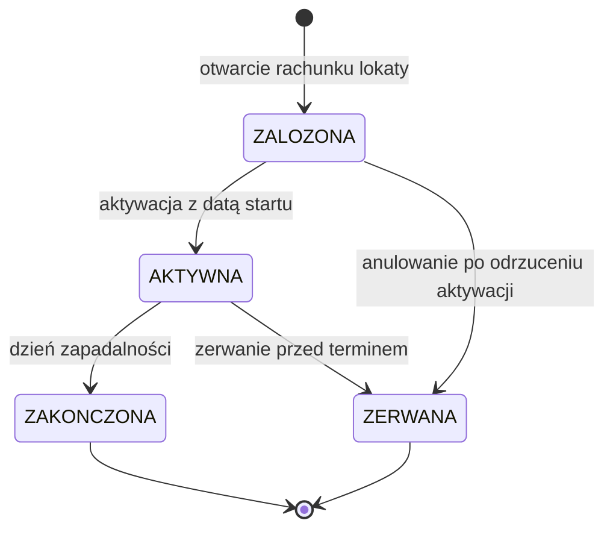

# Cykl życia lokaty

| Pole | Wartość |
|---|---|
| Obiekt (pojęcie DDM) | DDM-002.DOM-Rachunek |
| Zdolność | CAP-010 |

## Warunki wstępne

Lokata wchodzi w cykl życia, gdy:

- klient wybrał we wniosku produkt typu lokata terminowa i podał kwotę oraz okres od 1 do 24 miesięcy,
- weryfikacja tożsamości zakończyła się pozytywnie, a rachunek lokaty dostał numer.

Lokata to rodzaj rachunku, więc ta maszyna jest drugą maszyną stanów tego
samego pojęcia. Stany rachunku lokaty, od wniosku do zamknięcia, opisuje cykl
życia rachunku; ta maszyna opisuje stany umowy lokaty.

## Diagram maszyny stanów

<!-- Generowany z tabel poniżej albo eksportowany z EA do katalogu assets/. -->

## Stany — opis

### Słownik statusów

| Kod | Status | Opis | Czy końcowy |
|---|---|---|---|
| ZALOZONA | Założona | Rachunek lokaty otwarty, warunki lokaty ustalone; kapitał jeszcze nieprzyjęty | nie |
| AKTYWNA | Aktywna | Kapitał przyjęty; odsetki naliczają się od daty startu do dnia zapadalności | nie |
| ZERWANA | Zerwana | Lokata zakończona przed dniem zapadalności: zerwana przez klienta albo anulowana przed aktywacją; odsetki nie są wypłacane | tak |
| ZAKONCZONA | Zakończona | Okres lokaty upłynął; kapitał z odsetkami wypłacony klientowi | tak |

### Stany procesowe

| Stan z | Stan do | Opis przejścia | Typ przepływu |
|---|---|---|---|
| [*] | ZALOZONA | Otwarcie rachunku lokaty po pozytywnej weryfikacji tożsamości; kwota i okres z wniosku, oprocentowanie z oferty w dniu otwarcia | MAIN |
| ZALOZONA | AKTYWNA | System centralny aktywuje lokatę z datą startu, przyjmuje kapitał i wyznacza dzień zapadalności | MAIN |
| AKTYWNA | ZAKONCZONA | Nadchodzi dzień zapadalności; system wypłaca kapitał z odsetkami | MAIN |
| AKTYWNA | ZERWANA | Klient zrywa lokatę przed dniem zapadalności; system wypłaca sam kapitał | ALTERNATIVE |
| ZALOZONA | ZERWANA | System centralny trwale odrzuca aktywację, a eskalacja kończy się anulowaniem lokaty | ERROR |

## Kluczowe elementy

- Główna ścieżka sukcesu: ZALOZONA → AKTYWNA → ZAKONCZONA; w dniu zapadalności kapitał wraca do klienta z odsetkami, a rachunek lokaty zostaje zamknięty.
- Przejścia alternatywne: zerwanie aktywnej lokaty przed terminem (AKTYWNA → ZERWANA).
- Przekroczenie czasu: dzień zapadalności przenosi lokatę z AKTYWNA do ZAKONCZONA bez udziału klienta; lokata nie odnawia się automatycznie.
- Odrzucenia i rezygnacje: rezygnacja klienta to zerwanie lokaty z utratą odsetek; trwałe odrzucenie aktywacji kończy się anulowaniem lokaty (ZALOZONA → ZERWANA).

## Scenariusze błędów

- System centralny odrzuca aktywację lokaty: lokata zostaje w stanie ZALOZONA, a sprawa trafia do eskalacji. Ponowna aktywacja przenosi lokatę do AKTYWNA, anulowanie do ZERWANA.
- Wypłata kapitału w dniu zapadalności kończy się błędem: lokata zostaje w stanie AKTYWNA do skutecznej wypłaty, a za dni po dniu zapadalności odsetki się nie naliczają.
- Żądanie zerwania lokaty w stanie ZAKONCZONA albo ZERWANA: system je odrzuca, stan się nie zmienia.
