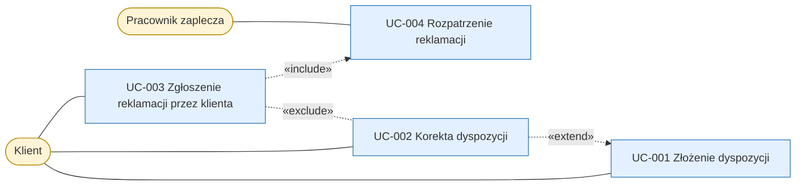

# Mapa scenariuszy dyspozycji i reklamacji

## Cel

Mapa zestawia scenariusze klienta i pracownika zaplecza z procesu obsługi
dyspozycji i z procesu reklamacji. Pokazuje, kiedy klient może skorygować
kwoty pozycji złożonej dyspozycji, a kiedy może ją już tylko zareklamować, oraz
że każde zgłoszenie reklamacji kończy się rozpatrzeniem.

## Diagram

<!-- Klasy dla aktorów, UC i TUC. -->

## Opis relacji

| Źródło | Relacja | Cel | Uzasadnienie |
|---|---|---|---|
| UC-002 | extend | UC-001 | Korekta jest krokiem warunkowym po złożeniu: klient zmienia kwoty pozycji bez zmiany kwoty łącznej tylko wtedy, gdy dyspozycja ma status ZAAKCEPTOWANA, czyli przed startem przebiegu rozliczenia, który ją obejmuje |
| UC-003 | exclude | UC-002 | Dla jednej dyspozycji korekta i reklamacja wykluczają się: korekta kwot jest możliwa tylko przed rozliczeniem, reklamacja tylko po rozliczeniu |
| UC-003 | include | UC-004 | Rozpatrzenie jest krokiem obowiązkowym: każde przyjęte zgłoszenie trafia do pracownika zaplecza, który podejmuje decyzję |

## Powiązanie z artefaktami szczegółowymi

- UC-001 — Złożenie dyspozycji
- UC-002 — Korekta dyspozycji
- UC-003 — Zgłoszenie reklamacji przez klienta
- UC-004 — Rozpatrzenie reklamacji
