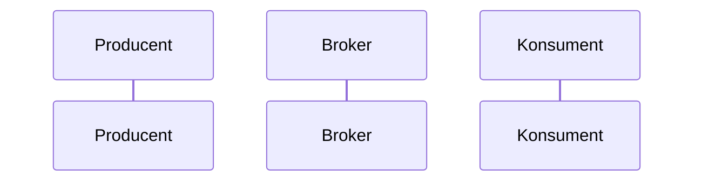

# {NazwaZdarzenia}

## Informacje podstawowe

| Pole | Wartość |
|---|---|
| Nazwa zdarzenia | {Nazwa zdarzenia} |
| Wersja | {Wersja} |
| System producenta | {System producenta} |
| Adres kanału | {Adres kanału} |
| Format | JSON / AVRO |
| Zdolność publikująca | CAP-{nnn} |

## Cel i zakres

{Po co jest zdarzenie i co obejmuje}

## Kontekst biznesowy

{Sytuacja biznesowa, w której powstaje zdarzenie}

## Przepływ danych



## Nagłówek komunikatu

<!-- Nagłówki wspólne dla zdarzeń opisuje konwencja; tu podajesz tylko nagłówki własne zdarzenia. Bez konwencji albo przy odstępstwie od niej wymieniasz wszystkie nagłówki. Sekcja przyjmuje dowolne tabele. -->

Według CONV-{nnn}. {Nagłówki własne zdarzenia}

## Specyfikacja schematu

| Atrybut | Typ | Obligatoryjność | Wartości / format | Opis biznesowy |
|---|---|---|---|---|
| {Atrybut} | {Typ} | tak / nie | {Wartości / format} | {Opis biznesowy} |

## Przykład ładunku

```json
{}
```

## Charakterystyka dostarczenia

| Cecha | Wartość |
|---|---|
| Gwarancja dostarczenia | {Gwarancja dostarczenia} |
| Idempotencja konsumenta | {Idempotencja konsumenta} |
| Kolejność | {Kolejność} |
| Klucz partycji | {Klucz partycji} |
| Retencja | {Retencja} |
| Kolejka wiadomości niedostarczonych | {Kolejka wiadomości niedostarczonych} |

## Encje

- ENT-{Nazwa}: {jak występuje w schemacie}

## Powiązanie z przepływem od początku do końca

{Miejsce zdarzenia w przepływie od początku do końca}

## Powiązane dokumenty

{Dokumenty związane ze zdarzeniem}
